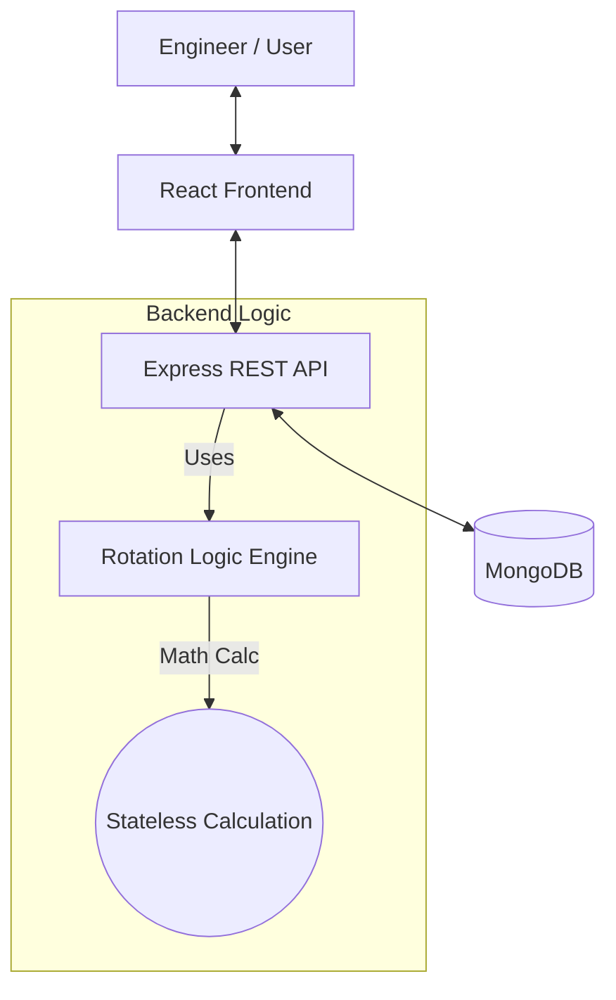

***

# 🚨 PagerLite - Incident Management System

**PagerLite** is a minimal full-stack On-Call Incident Management system designed to model core reliability engineering workflows. It allows teams to define on-call rotations, trigger incidents from external signals, and manage the incident lifecycle (Trigger → Acknowledge → Resolve).

## 🏗 Architecture Overview

The system creates a clean separation between **Data**, **Logic**, and **Presentation**, built on the **MERN Stack** (MongoDB, Express, React, Node.js).

### High-Level Diagram



### Core Components
1.  **Frontend (Client):** A React-based dashboard that polls the backend for real-time status updates. It visualizes service health and allows engineers to manage incidents.
2.  **Backend (API):** A Node.js/Express server that handles:
    *   **Incident State Machine:** Enforces valid transitions (Triggered → Acknowledged → Resolved).
    *   **Escalation Check:** A conceptual "Cron" endpoint that detects stale incidents.
3.  **Rotation Engine (`utils/rotationLogic.js`):** A specialized utility that calculates *who* is on call at any given millisecond using deterministic math, removing the need for complex calendar storage.
4.  **Database (Persistence):** MongoDB stores:
    *   **Services:** Policies, shift intervals, and engineer lists.
    *   **Incidents:** Status, assigned engineer, and audit history.
    *   **Users:** Contact details (mocked).

---

## 🧠 Key Design Decisions

### 1. Deterministic Rotation (Math vs. Calendar)
Instead of storing a calendar row for every single day in the database (which is hard to maintain), I implemented a **stateless algorithm**:
> `Index = ((CurrentTime - RotationStartTime) / ShiftDuration) % EngineerCount`

*   **Why:** This allows the system to instantly calculate the on-call person for *any* date (past, present, or future) with O(1) complexity and zero database maintenance.

### 2. Separation of Business Logic
The rotation calculation logic is isolated in `utils/rotationLogic.js`, separate from the API Controllers.
*   **Why:** This follows the **Single Responsibility Principle** and makes the core logic unit-testable without requiring a database connection or a running server.

### 3. Incident State Machine
The system strictly tracks the lifecycle of an alert.
*   **Why:** This provides auditability. Every action (Trigger, Ack, Resolve) generates a timestamped entry in the `history` array of the incident document, crucial for Post-Incident Reviews (post-mortems).

---

## 🚧 Limitations & Future Improvements

If I had more time, I would address the following:

| Limitation | Proposed Improvement |
| :--- | :--- |
| **Timezones** | Currently, the rotation logic uses the server's local time. I would normalize all dates to **UTC** in the backend and convert to the user's local time in the Frontend. |
| **Rigid Schedules** | The math-based rotation doesn't handle holidays or sick days. I would add an **"Overrides" collection** in MongoDB to handle temporary schedule swaps. |
| **Concurrency** | If two engineers acknowledge an incident simultaneously, the last write wins. I would implement **Optimistic Locking** (using version numbers) to prevent race conditions. |
| **Mock Alerts** | SMS/Email is currently logged to the console. I would integrate **Twilio or SendGrid** for real notifications. |
| **Polling** | Polling is inefficient at scale. I would refactor to use **Socket.io (WebSockets)** for instant bi-directional updates. |

---

## 🚀 Setup and Run Instructions

### Prerequisites
*   Node.js (v14+)
*   MongoDB 

### 1. Backend Setup
```bash
cd backend
npm install
npm install express mongoose
npm install --save-dev nodemon
# Start the server (runs on port 5000)
npm run dev
```

### 2. Frontend Setup
Open a new terminal window:
```bash
cd client
npm install
# Start the React app (opens localhost:3000)
npm run start
```


## 🧪 Example Workflows

### Scenario 1: The "Happy Path"
1.  **View Dashboard:** Open `http://localhost:3000`. You will see the "Payments API" service.
2.  **Check On-Call:** Observe the "On-Call" name (e.g., Alice). This is calculated live.
3.  **Trigger:** Click **"🔥 Trigger Incident"**.
    *   *Result:* A new row appears in the table with status **TRIGGERED**.
    *   *Backend Log:* Check the backend terminal to see: `[ALERT SMS] To: Alice...`
4.  **Acknowledge:** Click the **"Acknowledge"** button.
    *   *Result:* Status changes to **ACKNOWLEDGED** (Orange).
5.  **Resolve:** Click the **"Resolve"** button.
    *   *Result:* Status changes to **RESOLVED** (Green).

### Scenario 2: Escalation (Mocked)
1.  Trigger an incident but **do not** acknowledge it.
2.  Wait 5 minutes (or manually call the test endpoint).
3.  Run the escalation check:
    ```bash
    curl -X POST http://localhost:5000/api/incidents/escalate
    ```
4.  **Result:** The backend terminal will log `[ESCALATION] Incident X is stale. Notifying Manager.` and an entry is added to the incident history.


## 🎥 Demo

- 🎬 **Demo Video:** Available in the `demo_video/` folder  
- 🖥️ **Backend Terminal Logs (Screenshots):** Available in the `demo_video/` folder


